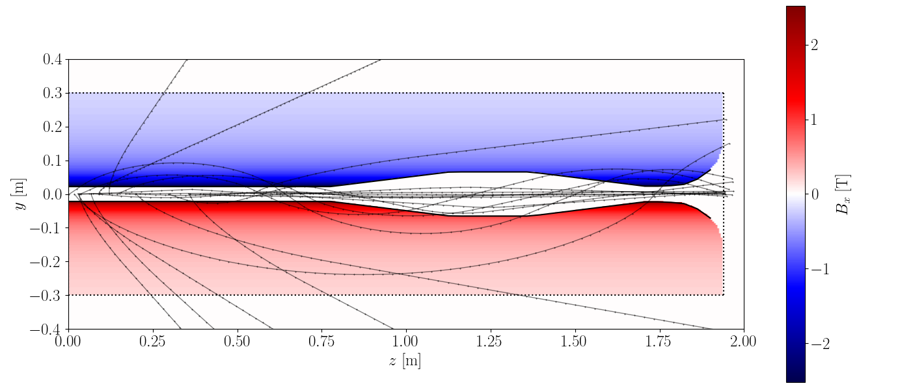
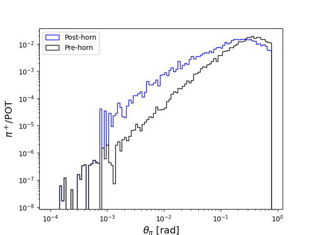
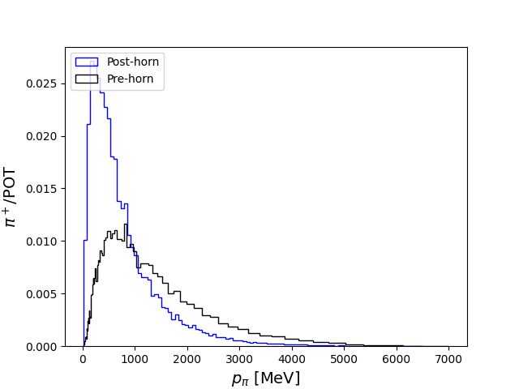

# RKHorn

A lightweight python library for simulating proton beam-induced charged pion fluxes and their radiative transport through a magnetic horn focusing system.


## Example Usage

One calls the ChargedPionFluxMiniBooNE class to simulate the pi+ / pi- fluxes coming out of the BNB horn geometry. However, with this class the incomingg proton flux can be changed as well as the selected horn current in kilo-Amps;

```
import rkhorn
from rkhorn import ChargedPionFluxMiniBooNE

rkhornsim = ChargedPionFluxMiniBooNE(proton_energy=8.0e3 + M_P, meson_charge=1.0,
                                     solid_angle_cut=0.00924, n_samples=50000, n_pot=1,
                                     horn_current=300.0)
```

To simulate the beamspot, the production of charged pions of a chosen ```meson_charge=1``` or ```meson_charge=-1```, and the focusing, we call
```
rkhornsim.simulate()
```
which will simulate ```n_samples``` number of weighted Monte-Carlo samples of charged mesons through the horn system. To extract the final momenta, angles, and weights, use
```
pi_thetas_post_horn = rkhornsim.pip_theta_post_horn
pi_momenta_post_horn = rkhornsim.pip_p_post_horn
pi_weights_post_horn = rkhornsim.pip_wgt_post_horn
```
The weights will be normalized to the number of protons-on-target (POT), ```n_pot``` that the user specifies above.


### Plotting example (1)
We can visualize the tracks of the simulated mesons as they transport through the horn system. Let's start by simulating a small number of mesons, just ```n_samples=20```, but keep the histories of each pion by using ```simulate_with_histories()``` instead of ```simulate()```, which returns a list of lists for the x, y, and z positions over time:
```
rkhornsim2 = ChargedPionFluxMiniBooNE(proton_energy=8.0e3 + M_P, meson_charge=1.0,
                                     solid_angle_cut=0.00924, n_samples=20, n_pot=1,
                                     horn_current=300.0)

xs, ys, zs = rkhornsim2.simulate_with_histories()

horn_start = rkhornsim2.rksolver.horn_start
horn_end = rkhornsim2.rksolver.horn_end

# Plot the horn boundaries
z_values = np.linspace(0.0, 1.9, 50)
y_inner = rkhornsim2.rksolver.inner_radius(z_values)

fig = plt.figure()
ax = fig.add_subplot(111)

plt.hlines(y=[-0.3, 0.3], xmin=horn_start, xmax=horn_end, color="k", ls="dotted")
plt.vlines(x=[horn_start, horn_end], ymin=-0.3, ymax=0.3, color="k", ls="dotted")
plt.plot(z_values, y_inner, color="k")
plt.plot(z_values, -y_inner, color="k")

for i in range(rkhornsim2.n_samples):
    plt.plot(zs[i], ys[i], color="b", linewidth=1.0, alpha=0.5)

ax.set_aspect('equal')

plt.ylabel(r"$y$ [m]", fontsize=12)
plt.xlabel(r"$z$ [m]", fontsize=12)
plt.ylim((-0.4,0.4))
plt.xlim((-0.1, 3.0))
plt.xticks(fontsize=12)
plt.yticks(fontsize=12)
plt.tight_layout()
plt.show()
```

Giving us the following nice plot:


Here we can see the pi+ tracks projected onto the y,z plane in blue. Their origins are always inside the BNB target inside the Horn boundary. We cut off the simulation either when their z values reach 3 meters, or when the time exceeds 10000 seconds or when the pion decays.

### Plotting example 2

We can visualize the statistics for many more pions by increasing the sample size to ```n_samples=50000```. This should take several seconds.

```
rkhornsim = ChargedPionFluxMiniBooNE(proton_energy=8.0e3 + M_P, meson_charge=1.0,
                                     solid_angle_cut=0.00924, n_samples=50000, n_pot=1,
                                     horn_current=300.0)


rkhornsim.simulate()
```

The distributions can then be plotted with
```

pi_thetas_pre_horn = rkhornsim.meson_flux_pre_horn[:,1]
pi_momenta_pre_horn = rkhornsim.meson_flux_pre_horn[:,0]
pi_weights_pre_horn = rkhornsim.meson_flux_pre_horn[:,2]

pi_thetas_post_horn = rkhornsim.pip_theta_post_horn
pi_momenta_post_horn = rkhornsim.pip_p_post_horn
pi_weights_post_horn = rkhornsim.pip_wgt_post_horn   # the number of pions that decayed pointing within detector solid angle

print(pi_weights_post_horn, pi_weights_pre_horn)

theta_bins = np.logspace(-4, np.log10(np.pi/4), 100)
momentum_bins = np.logspace(1, np.log10(7000.0), 100)

plt.hist(pi_thetas_post_horn, weights=pi_weights_post_horn, bins=theta_bins, histtype='step', color='b', density=False, label="Post-horn")
plt.hist(pi_thetas_pre_horn, weights=pi_weights_pre_horn, bins=theta_bins, density=False, color='k', histtype='step', label="Pre-horn")
plt.yscale('log')
plt.ylabel(r"$\pi^+$/POT", fontsize=14)
plt.xlabel(r"$\theta_\pi$ [rad]", fontsize=14)
plt.xscale('log')
plt.legend(loc="upper left")
plt.show()
```



This visualizes the effect of the focusing; the pions post-horn are now pointed to lower angles with respect to the beam line, and therefore their decay products (neutrinos) will have a higher flux within the detector solid angle downstream! Notice also that for angles below 1e-3 radians, these pions were created with angles that simply point down the target volume and never enter the magnetic field, so their initial and final angles are the same. We do not simulate the random walk as pions scatter through the target material (yet).



Here we can also look at the pre-horn and post-horn momenta distribution. The post-horn momentta are softer, as expected.


## TODO
* adding pion scattering and absorption in material
* implementing custom horn geometries
* implementing alternative target materials
* simulating decay positions

## Implementing a custom horn geometry

